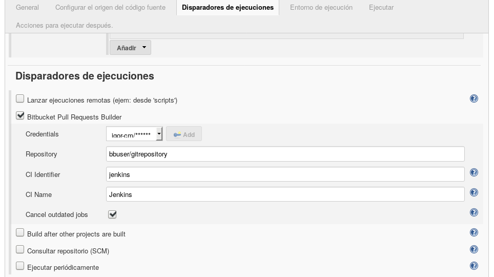
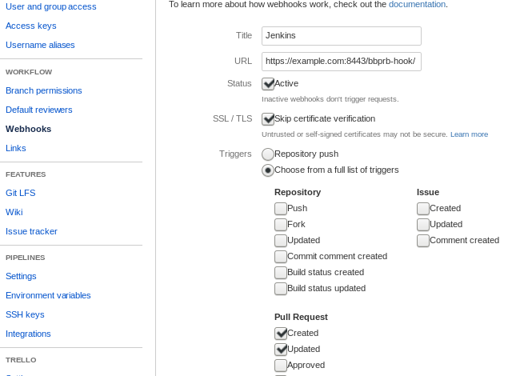

BBPRB
=====

This plugin is a revision of original [Bitbucket Pull Request Builder Plugin](https://wiki.jenkins.io/display/JENKINS/Bitbucket+pullrequest+builder+plugin).
It was started by adding support for [Bitbucket webhooks](https://confluence.atlassian.com/bitbucket/manage-webhooks-735643732.html)
and resulted in massive rewrite and deleting the code.


Configuration
=============

Configuring Jenkins job
-----------------------

This plugin needs credentials to access Bitbucket API. The credentials comprise
the user's name and a password. This password is known as "App password" and
it is not the same as the user's password.

Only Git repositories are supported.  No special configration is required
for the [Git plugin](https://plugins.jenkins.io/git), but the repository URL
should point to the same repository specified for this plugins.  In fact,
they may not match. After receiving a web-hook this plugin uses its options
to find a job to be triggered, sets some relevant options (like commit hash)
and starts the build. If repositories are not the same, you will just get a
failure because the hash is not found, etc.

These environment variables are set when the job is triggered by this plugin:

```
bbprbDestinationBranch
bbprbDestinationCommitHash
bbprbDestinationRepository
bbprbPullRequestAuthor
bbprbPullRequestId
bbprbPullRequestTitle
bbprbSourceBranch
bbprbSourceCommitHash
bbprbSourceRepository
```


Trigger's options in the job's XML configuration file:

```xml
  <triggers>
    <org.jenkinsci.plugins.bbprb.BitbucketBuildTrigger plugin="bbprb@0.2.0">
      <ciKey>jenkins</ciKey>
      <ciName>Jenkins</ciName>
      <credentialsId>bitbucket-pwd</credentialsId>
      <destinationRepository>bbuser/gitrepository</destinationRepository>
      <cancelOutdatedJobs>true</cancelOutdatedJobs>
    </org.jenkinsci.plugins.bbprb.BitbucketBuildTrigger>
  </triggers>

```

Trigger's options in Jenkins graphical user interface:




Configuring Bitbucket web-hook
------------------------------

The end-point is `/bbprb-hook/`. Currently only two events are supported:
pull request is created and pull request is updated.




Installation
============

Use [Apache Maven](https://maven.apache.org/) to build and package the plugin:

```
$ cd bbprb
$ mvn install

```

This will create the file `./target/bbprb.hpi` that you can deploy to Jenkins.
See [Jenkins Plugin tutorial](https://wiki.jenkins.io/display/JENKINS/Plugin+tutorial) for more details.
Other useful commands are `mvn compile`, `mvn hpi:hpi`.


Copyright
=========

(C) 2017-2018 Igor Pashev <pashev.igor@gmail.com>.

(C) 2014 S.nishio + Martin Damovsky.

This plugin is free software under the [BSD License](./COPYING).

