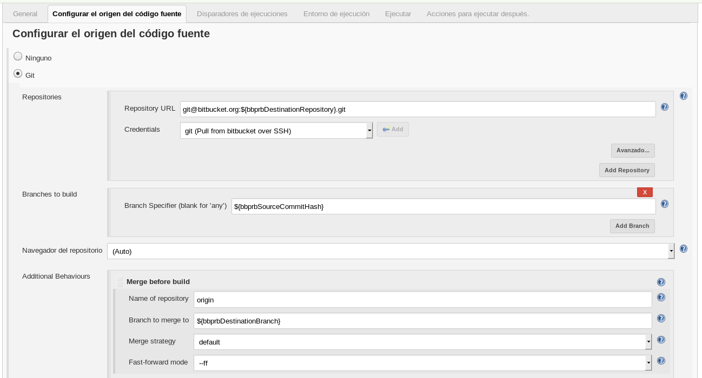

BBPRB
=====

This plugin is a revision of original [Bitbucket Pull Request Builder Plugin](https://wiki.jenkins.io/display/JENKINS/Bitbucket+pullrequest+builder+plugin).
It was started by adding support for [Bitbucket webhooks](https://confluence.atlassian.com/bitbucket/manage-webhooks-735643732.html)
and resulted in massive rewrite and deleting the code. Jenkins 2.60+ is required.


Configuration
=============

Configuring Jenkins job
-----------------------

This plugin needs credentials to access Bitbucket API. The credentials comprise
the user's name and a password. This password is known as "App password" and
it is not the same as the user's password.

Only Git repositories are supported.

These environment variables are set when the job is triggered by this plugin:

```
bbprbDestinationBranch
bbprbDestinationCommitHash
bbprbDestinationRepository
bbprbPullRequestAuthor
bbprbPullRequestId
bbprbPullRequestTitle
bbprbSourceBranch
bbprbSourceCommitHash
bbprbSourceRepository
```

Recommended Git configuration:

* Repository URL: `git@bitbucket.org:${bbprbDestinationRepository}.git`
* Branch Specifier: `${bbprbSourceCommitHash}`
* [Optional] Branch to merge to: `${bbprbDestinationBranch}`




Trigger's options in Jenkins graphical user interface:


Trigger's options in the job's XML configuration file:

```xml
  <triggers>
    <org.jenkinsci.plugins.bbprb.BitbucketBuildTrigger plugin="bbprb@0.2.0">
      <spec></spec>
      <ciKey>jenkins</ciKey>
      <ciName>Jenkins</ciName>
      <credentialsId>bitbucket-pwd</credentialsId>
      <destinationRepository>bbuser/gitrepository</destinationRepository>
      <cancelOutdatedJobs>true</cancelOutdatedJobs>
    </org.jenkinsci.plugins.bbprb.BitbucketBuildTrigger>
  </triggers>

```


Configuring Bitbucket web-hook
------------------------------

The end-point is `/bbprb-hook/`. Currently only two events are supported:
pull request is created and pull request is updated.


Installation
============

Use [Apache Maven](https://maven.apache.org/) to build and package the plugin:

```
$ cd bbprb
$ mvn install

```

This will create the file `./target/bbprb.hpi` that you can deploy to Jenkins.
See [Jenkins Plugin tutorial](https://wiki.jenkins.io/display/JENKINS/Plugin+tutorial) for more details.
Other useful commands are `mvn compile`, `mvn hpi:hpi`.


Copyright
=========

(C) 2017-2018 Igor Pashev <pashev.igor@gmail.com>.

(C) 2014 S.nishio + Martin Damovsky.

This plugin is free software under the [BSD License](./COPYING).

